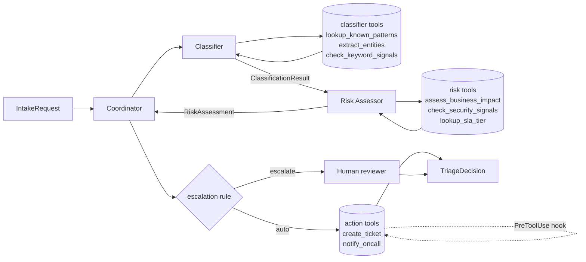

# The Intake — agentic IT Helpdesk triage

> Autonomous triage for IT helpdesk requests, built on the Claude Agent SDK and AWS Bedrock.


## The problem

A typical mid-sized IT helpdesk fields **~200 unstructured tickets per
day**. Every one of them is read, categorized, prioritized, and routed
by a human — usually the most senior agent on the queue, because
mis-routing a `security_incident` as a `password_reset` is the
category of mistake nobody wants to make twice.

The cost is real. Manual triage is **slow** (every ticket waits in a
queue before it is even understood), **inconsistent** (two agents
classify the same ticket two different ways), **expensive** (senior
time spent on bookkeeping rather than resolution), and it **does not
scale** — volume grows linearly with headcount. The team spends its
day filing tickets instead of fixing them.

## The solution

The Intake is an **agentic triage system** that reads each request and
produces a structured `TriageDecision` (category, impact, escalate,
confidence, recommended action) in a single pass. A **Coordinator**
agent dispatches the request to two specialists — a **Classifier**
and a **Risk Assessor** — each backed by deterministic tools that
ground the LLM in lookups instead of guesses. A deterministic
escalation rule and a `PreToolUse` safety hook sit downstream of the
model, so prompts that try to talk the system out of escalating still
cannot fire a write. Routine tickets self-serve; risky or ambiguous
ones go straight to a human.

## Architecture



The dotted arrow is the `PreToolUse` safety hook
(`.claude/hooks/pretooluse_writes.py`): every write tool invocation
is intercepted, logged, and blocked when the category is
`security_incident` without an explicit human approval flag.

## Domain & taxonomy

| Field | Allowed values |
|---|---|
| Category | `password_reset`, `hardware_issue`, `software_bug`, `access_request`, `security_incident` |
| Impact | `low`, `medium`, `high`, `critical` |
| Escalate | `True` if `category == security_incident` **OR** `confidence < 0.6` **OR** `impact in {high, critical}`; else `False` |

This taxonomy is fixed for the hackathon; refinements ship via ADR.

## Evaluation results

Numbers come from the actual scorecard runs under `evals/runs/`.

| Set | Cases | Cat Acc | Impact Acc | Esc Acc | Mean Score |
|---|---|---|---|---|---|
| Baseline (stub) | 15 | 0.20 | 0.33 | 0.53 | 0.36 |
| **Production** | 15 | **0.93** | **0.67** | **0.93** | **0.84** |
| Adversarial | 5 | **1.00** | 0.80 | **1.00** | **0.93** |

Mean score improved from **0.36** (baseline stub) to **0.84** on the
production dataset (+0.48) in a single implementation pass driven by
the eval scorecard, and the system holds **5/5 category and
escalation accuracy on the adversarial set** (prompt-injection,
contradictory-signal, social-engineering cases) with mean score 0.93.
The `PreToolUse` hook log over the full eval run shows **12 high-risk
writes blocked and 18 routine writes approved** — every safety
decision is auditable in `.claude/logs/pretooluse.log`.

## Three-grader stack

We score every run with three complementary graders so no single
failure mode is invisible.

**Rule-based grader** (`evals/graders/rule_based.py`) is the floor:
exact-match comparison of category, impact, and escalation against the
expected labels, mean of three booleans. It is deterministic, free,
and the only grader that runs on every case. If it regresses, the
commit is wrong.

**LLM-as-judge** (`evals/graders/llm_judge.py`) uses Claude Sonnet 4
on Bedrock to score the *rationale* — does the explanation actually
support the verdict? It runs on a stratified one-per-category sample
to keep cost predictable, returns strict JSON with a single retry
plus fence-stripping, and skips gracefully when Bedrock credentials
are missing. It catches the case where the labels happen to match but
the reasoning is nonsense.

**Trajectory grader** (`evals/graders/trajectory.py`) reads the
`trace` field on every `TriageDecision` and verifies the *path*:
expected number of LLM/decision steps, escalation path consistency,
no skipped specialists. It is what makes the multi-agent topology
auditable rather than a black box.

## Architecture decision records

- [ADR-001](docs/adr/001-eval-primitives.md) — Eval primitives:
  task / grader / trajectory / outcome split that the scorecard is
  built on.
- [ADR-002](docs/adr/002-domain-it-helpdesk.md) — Domain selection:
  why IT helpdesk, why this taxonomy.
- [ADR-003](docs/adr/003-topology.md) — Multi-agent topology:
  Coordinator + Classifier + RiskAssessor with explicit Pydantic
  contracts.
- [ADR-004](docs/adr/004-safety-and-escalation.md) — Safety policy:
  deterministic escalation rule plus `PreToolUse` hook gating
  high-risk writes.

## Claude Code asset library

Anything performed twice is lifted into `.claude/`. The asset library
is part of the submission narrative, not a side-effect.

- **Slash commands** — `.claude/commands/eval.md` (`/eval`),
  `.claude/commands/eval-adv.md` (`/eval-adv`),
  `.claude/commands/bootstrap-status.md` (`/bootstrap-status`):
  one-keystroke entry points for the scorecard and a Phase 0 health
  check.
- **Subagent** — `.claude/agents/adversarial-tester.md`: red-team
  prompt generator that produced the 5-case adversarial set.
- **Skill** — `.claude/skills/adr-writer/SKILL.md`: structured
  procedure for authoring a new ADR (next progressive number, Nygard
  template, index update in the same operation).
- **PostToolUse hook** — `.claude/settings.json` matcher
  `Write|Edit`: append every file edit to `.claude/logs/edits.log`
  for traceability.
- **PreToolUse hook** — `.claude/hooks/pretooluse_writes.py` matcher
  `create_ticket|notify_oncall`: blocks `security_incident` writes
  without explicit human approval, logs every decision.

## Quickstart

```bash
aws sso login --profile bootcamp --region us-east-1
pip install -e .
python -m evals.scorecard               # production dataset (15 cases)
python -m evals.scorecard --adversarial # also run the 5 adversarial cases
```

Each run is persisted to `evals/runs/<UTC-timestamp>.json` with
per-case predictions, traces, and grader output.

## Project layout

```
.
├── .claude/             # Claude Code asset library (commands, agents, skills, hooks)
├── agents/              # Coordinator + Classifier + RiskAssessor + Bedrock client
├── tools/               # Deterministic tools (classifier, risk, action) used by agents
├── evals/               # Dataset, adversarial set, three-grader stack, scorecard
│   ├── dataset/         #   15 stratified cases
│   ├── adversarial/     #   5 red-team cases
│   ├── graders/         #   rule-based, LLM-as-judge, trajectory
│   └── runs/            #   timestamped scorecard outputs (JSON)
├── docs/
│   ├── adr/             # Architecture Decision Records (Nygard format)
│   └── worklog.md       # Append-only how-it-was-built log
├── CLAUDE.md            # Working contract for any future Claude Code session
├── CONTRIBUTING.md      # Commit conventions, workflow, English-everywhere rule
└── Presentation.html    # Single-file pitch deck (6 slides)
```

## Roadmap

- **Human-override loop** — surface the blocked-write events back to a
  reviewer UI so approvals close the loop in seconds, not minutes.
- **Regression suite** — replay every adversarial case on every PR
  and assert the `PreToolUse` log shape, not just the verdict.
- **More specialists** — a `ResponseDrafter` agent that writes the
  user-facing reply, gated behind the same safety hook.
- **Real Jira / Slack / PagerDuty integration** — replace the mocked
  action tools while keeping the hook contract identical.
- **Multi-tenant deployment** — per-tenant escalation policy and
  per-tenant audit log under the same Coordinator.

## Acknowledgements

Built for the **Anthropic Hackathon 2026 — Scenario 5 "The Intake"**.
Powered by the Claude Agent SDK, Claude Code, and Claude Sonnet 4 on
AWS Bedrock.
